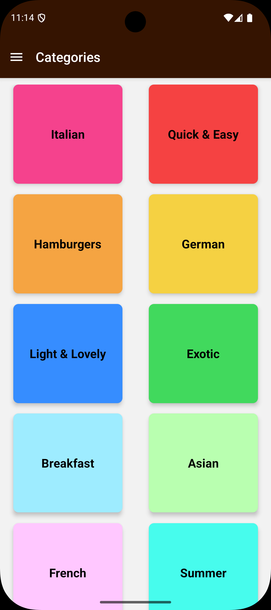
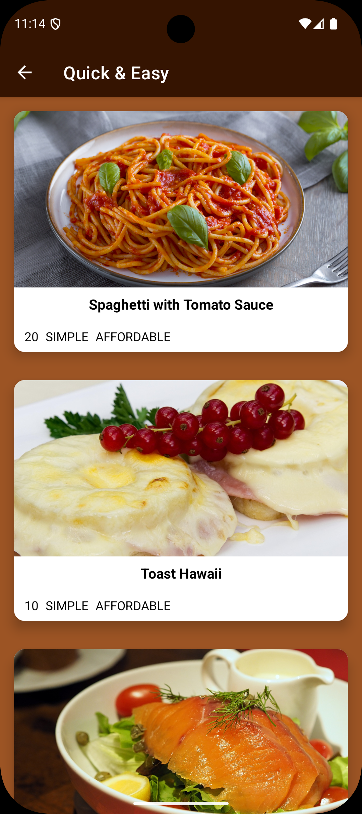
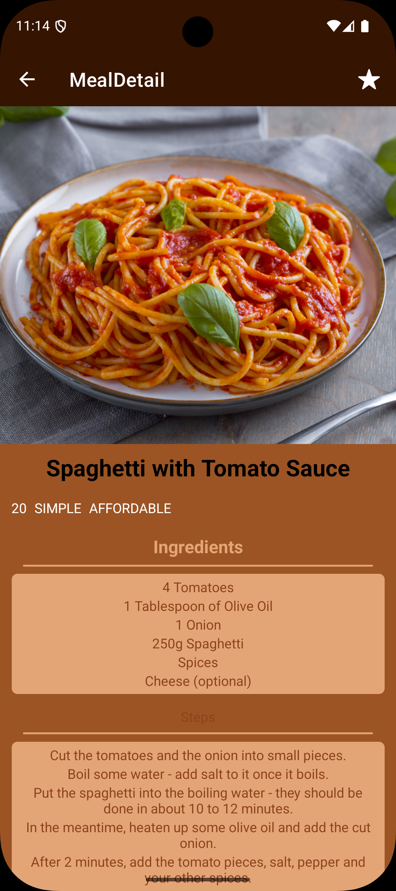

# 🍽️ React Native Menu App

> 🚀 A modern, responsive food menu mobile application built using React Native.  
> It demonstrates dynamic content rendering, smooth navigation, and a clean, scalable UI across Android and iOS.

---

## 📸 App Preview

  
  
  

---

## ✨ Highlights

- ⚡ Dynamic UI rendering (no hardcoded menu items)
- 🧩 Reusable component-based architecture
- 🧭 Seamless multi-screen navigation
- 📱 Cross-platform support (Android & iOS)
- ⚡ Optimized and responsive performance

---

## 🚀 Project Overview

The React Native Menu App provides a smooth and intuitive food browsing experience.  
Users can explore categories and view detailed information about each menu item.

---

## ✨ Features

- 📋 Browse menu categories
- 🍔 View detailed meal/item information
- 🧭 Navigation using Drawer and Stack
- 🖼️ Image-based UI for better UX
- ⚡ Fast and responsive performance

---

## 🏗️ Tech Stack

- ⚛️ React Native
- 📦 JavaScript (ES6+)
- 🧭 React Navigation
- 🧱 Component-based architecture

---

## 📂 Project Structure

\`\`\`bash
React-Native-Menu/
│── components/
│── screens/
│── data/
│── navigation/
│── assets/
│── App.js
\`\`\`

---

## ⚙️ Installation & Setup

### 1. Clone the repository

\`\`\`bash
git clone https://github.com/ManashkVerma/React-Native-Menu.git
\`\`\`

### 2. Navigate to project

\`\`\`bash
cd React-Native-Menu
\`\`\`

### 3. Install dependencies

\`\`\`bash
npm install
\`\`\`

### 4. Run the app

**Android**
\`\`\`bash
npx react-native run-android
\`\`\`

**iOS**
\`\`\`bash
npx react-native run-ios
\`\`\`

---

## 🧠 Key Learnings

- Navigation handling in React Native
- Reusable component architecture
- Dynamic rendering using data
- UI/UX structuring for mobile apps

---

## 🔮 Future Improvements

- 🔍 Search functionality
- ❤️ Favorites feature
- 🌐 API integration
- 🎨 Dark mode

---

## 🤝 Contributing

1. Fork the repo
2. Create a branch
3. Commit changes
4. Push and open PR

---

## 📬 Contact

GitHub: https://github.com/ManashkVerma

---

## ⭐ Support

Give it a ⭐ if you like the project!
